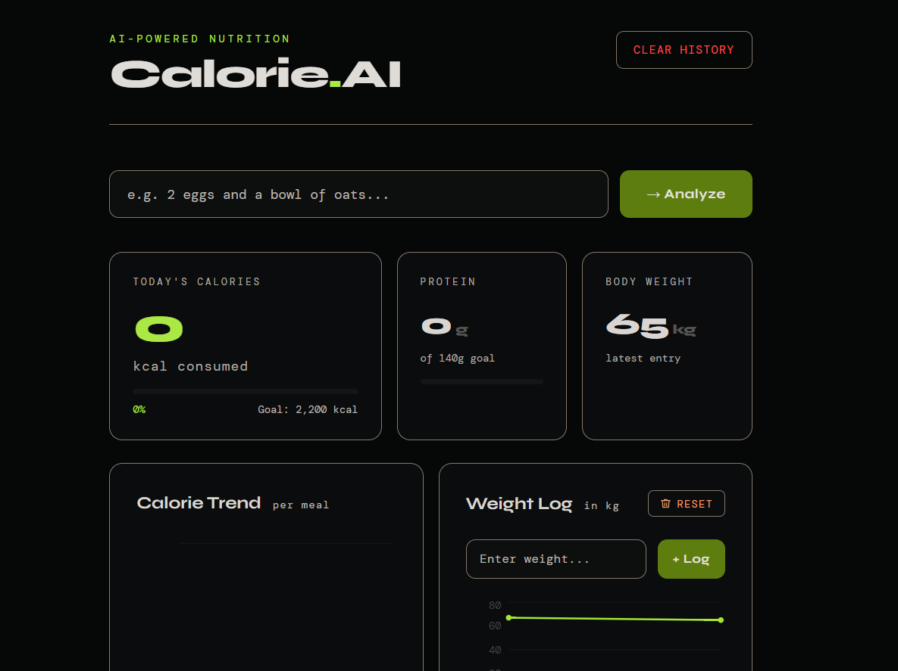

# 🥗 AI Calorie Tracker

A full-stack calorie and macro tracking app that uses AI to analyze meals from plain text descriptions. Log what you eat, track your weight, and get personalized calorie/macro goals based on your body stats — no manual nutrition lookup required.

---

## ✨ Features

- 🍽️ **AI Meal Analysis** — type in a meal (e.g. *"2 eggs and a bowl of oats"*) and instantly get calories, protein, carbs, and fat
- 📊 **Calorie & Protein Goals** — live progress bars tracking daily intake against targets
- ⚖️ **Weight Tracking** — log body weight over time with a trend chart
<<<<<<< HEAD
- 🧮 **Personal Macro Calculator** — calculates BMR (Mifflin-St Jeor), TDEE, and daily macro targets based on height, weight, age, gender, activity level, and goal (lose / maintain / gain)
=======
>>>>>>> b9d81120ed6cf1a8d3897bf9ecd7f43ae6cf6400
- 📈 **Interactive Charts** — calorie trend and weight trend visualizations (Recharts)
- 🗑️ **Full CRUD** — delete individual meals, clear meal history, or clear weight history independently
- 🌑 **Dark, modern UI** — custom dashboard design with no external UI framework dependency

---

## 🛠️ Tech Stack

**Frontend**
- [Next.js](https://nextjs.org/) (App Router) + TypeScript
- [Recharts](https://recharts.org/) for data visualization
- [Axios](https://axios-http.com/) for API requests

**Backend**
- [FastAPI](https://fastapi.tiangolo.com/) (Python)
- [SQLAlchemy](https://www.sqlalchemy.org/) for the database layer
- SQLite (default) — swappable for Postgres/MySQL
<<<<<<< HEAD
- AI/LLM API for natural-language food analysis (configurable)
=======
- LOCAL LLM (Ollama) integration for natural-language food analysis (configurable)
>>>>>>> b9d81120ed6cf1a8d3897bf9ecd7f43ae6cf6400

---

## 📂 Project Structure

```
ai-calorie-tracker/
├── frontend/              # Next.js app
│   ├── app/
│   │   └── page.tsx        # Main dashboard UI
│   └── package.json
├── backend/                # FastAPI app
│   ├── main.py              # API routes
│   ├── models.py            # SQLAlchemy models (Meal, WeightLog)
│   ├── database.py          # DB session/engine config
│   └── requirements.txt
└── README.md
```

> Adjust the structure above to match your actual repo layout if it differs.

---

## 📸 Screenshot



---

## 🤝 Contributing

Contributions, issues, and feature requests are welcome! Feel free to check the [issues page](../../issues) or open a pull request.

---
